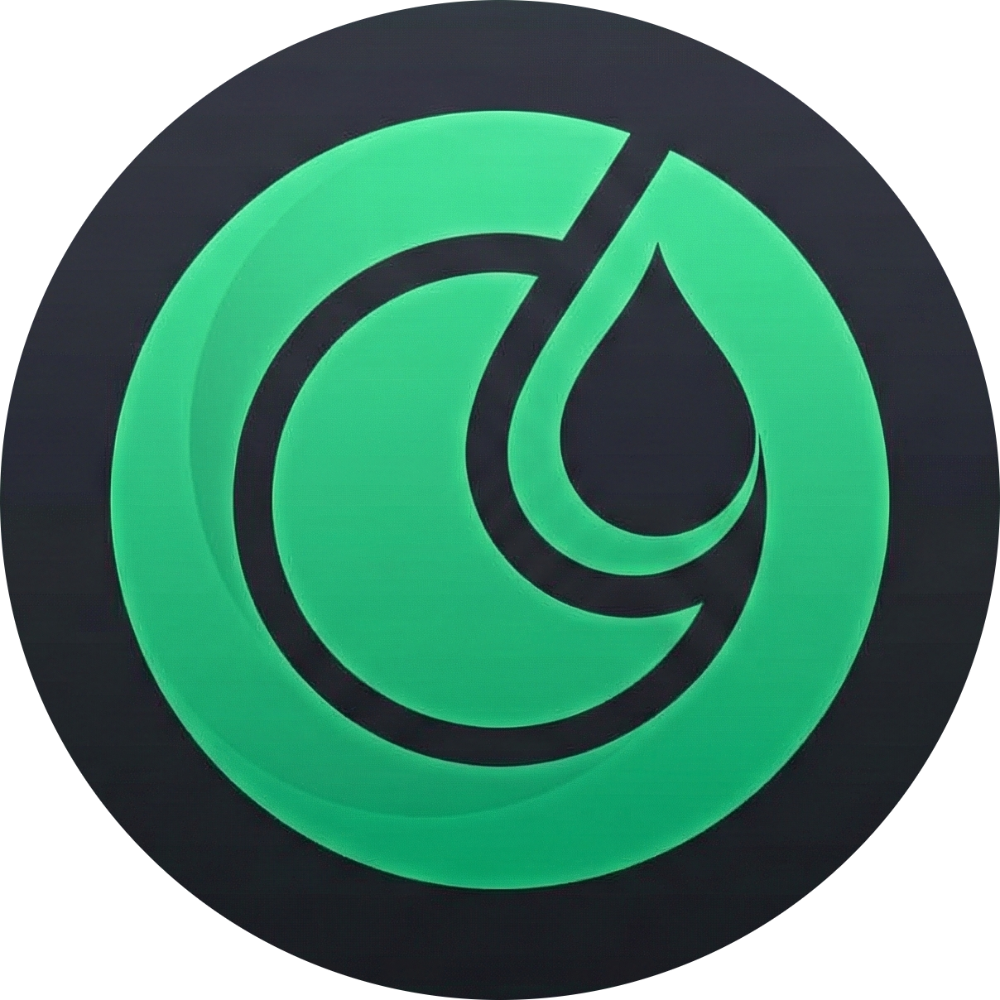

# 🍽️ DishDrop



**DishDrop** is a modern, responsive web application designed to help food enthusiasts discover, explore, and cook delicious recipes from around the world. Built with vanilla JavaScript and powered by TheMealDB API, DishDrop offers an intuitive interface for browsing thousands of recipes, ingredients, and cuisines.

---

## ✨ Features

### 🔍 **Recipe Discovery**

- **Featured Recipes**: Curated selection of popular and trending dishes
- **Random Meals**: Discover new recipes with a single click
- **Popular Recipes**: Browse the most-loved meals from the community

### 🔎 **Advanced Search**

- **Search by Name**: Find specific recipes instantly
- **Filter by Category**: Browse Beef, Chicken, Vegan, Seafood, Desserts, and more
- **Filter by Cuisine**: Explore authentic dishes from countries worldwide
- **Search by Ingredient**: Find recipes based on what you have in your kitchen

### 📖 **Detailed Recipe Information**

- Step-by-step cooking instructions
- Complete ingredient lists with measurements
- Video tutorials (YouTube integration)
- Source links for additional information
- Nutritional categories and cuisine origins

### 🎨 **User Experience**

- **Responsive Design**: Seamless experience across desktop, tablet, and mobile devices
- **Dark Theme**: Modern, eye-friendly interface with green accent colors
- **Smooth Animations**: Powered by AOS (Animate On Scroll) library
- **Pagination**: Browse ingredients with 30 items per page for optimal performance
- **Real-time Search**: Instant filtering as you type

---

## 🛠️ Tech Stack

### **Frontend**

- **HTML5**: Semantic markup for better SEO and accessibility
- **CSS3**: Custom styling with CSS variables and flexbox/grid layouts
- **JavaScript (ES6+)**: Modern JavaScript features for dynamic functionality

### **Libraries & Frameworks**

- **jQuery 3.6.0**: DOM manipulation and AJAX requests
- **AOS (Animate On Scroll)**: Scroll-triggered animations
- **Font Awesome 4.7.0**: Icon library

### **API**

- **TheMealDB API**: Free recipe database with 1000+ meals
  - Base URL: `https://www.themealdb.com/api/json/v1/1/`
  - Endpoints: Categories, Ingredients, Countries, Search, Random, Lookup

### **SEO & Performance**

- Meta tags for search engine optimization
- Lazy loading for images
- Sitemap.xml for better indexing
- Robots.txt for crawler guidance

---

## 📁 Project Structure

```
DishDrop/
├── index.html              # Home page
├── style.css               # Global styles
├── main.js                 # Home page logic
├── robots.txt              # SEO crawler instructions
├── sitemap.xml             # Site structure for search engines
├── README.md               # Project documentation
│
├── Search/                 # Search results page
│   ├── index.html
│   ├── main.js
│   └── style.css
│
├── MealDetails/            # Recipe details page
│   ├── index.html
│   ├── main.js
│   └── style.css
│
├── countries/              # Cuisines by country
│   ├── index.html
│   ├── main.js
│   └── style.css
│
├── categories/             # Recipe categories
│   ├── index.html
│   ├── main.js
│   └── style.css
│
└── ingredients/            # Browse by ingredients
    ├── index.html
    ├── main.js
    └── style.css
```

---

## 🚀 Getting Started

### **Prerequisites**

- A modern web browser (Chrome, Firefox, Safari, Edge)
- Internet connection (for API calls and CDN resources)

### **Installation**

1. **Clone the repository**

   ```bash
   git clone https://github.com/yourusername/dishdrop.git
   cd dishdrop
   ```

2. **Open in browser**

   - Simply open `index.html` in your web browser
   - Or use a local server (recommended):

     ```bash
     # Using Python 3
     python -m http.server 8000

     # Using Node.js (http-server)
     npx http-server
     ```

3. **Access the application**
   - Navigate to `http://localhost:8000` (or the port shown)

---

## 📖 Usage Guide

### **Home Page**

- Browse featured recipes in the main content area
- View popular recipes in the sidebar
- Explore random meal suggestions
- Use the search bar to find specific recipes
- Navigate to Categories, Countries, or Ingredients via the header menu

### **Search**

- Enter a recipe name in the search bar
- Press Enter or click the search button
- View results with images, categories, and descriptions
- Click "View Recipe" for detailed instructions

### **Categories**

- Browse recipes by food type (Beef, Chicken, Vegan, etc.)
- Click a category to see all related recipes
- Each recipe card shows an image and name

### **Countries**

- Explore cuisines from around the world
- View country flags and names
- Click to see authentic recipes from that region

### **Ingredients**

- Browse an extensive list of ingredients (paginated)
- Use the search bar to filter ingredients
- Click an ingredient to find recipes that use it
- Navigate through pages using pagination controls

### **Recipe Details**

- View complete cooking instructions
- See ingredient lists with measurements
- Watch video tutorials (if available)
- Access source links for more information

---

## 🎨 Design Philosophy

DishDrop follows modern web design principles:

- **Dark Theme**: Reduces eye strain and provides a premium feel
- **Green Accents**: Represents freshness and food
- **Card-based Layout**: Easy scanning and visual hierarchy
- **Responsive Grid**: Adapts to all screen sizes
- **Smooth Animations**: Enhances user engagement without being distracting

---

## 🔧 Configuration

### **API Configuration**

The API URL is defined in each `main.js` file:

```javascript
const API_url = "https://www.themealdb.com/api/json/v1/1/";
```

### **Pagination Settings**

Adjust items per page in `ingredients/main.js`:

```javascript
const itemsPerPage = 30; // Change this value
```

### **Animation Settings**

Modify AOS initialization in any `main.js`:

```javascript
AOS.init({
  once: true, // Animation triggers only once
  duration: 1000, // Animation duration in ms
  offset: 100, // Offset from trigger point
});
```

---

## 🌐 Browser Support

- ✅ Chrome (latest)
- ✅ Firefox (latest)
- ✅ Safari (latest)
- ✅ Edge (latest)
- ⚠️ Internet Explorer (not supported)

---

## 📝 SEO Features

- **Meta Tags**: Unique title, description, and keywords for each page
- **Semantic HTML**: Proper heading hierarchy and semantic elements
- **Alt Text**: All images have descriptive alt attributes
- **Sitemap**: XML sitemap for search engine crawlers
- **Robots.txt**: Crawler guidance and sitemap reference

---

## 🤝 Contributing

Contributions are welcome! Here's how you can help:

1. Fork the repository
2. Create a feature branch (`git checkout -b feature/AmazingFeature`)
3. Commit your changes (`git commit -m 'Add some AmazingFeature'`)
4. Push to the branch (`git push origin feature/AmazingFeature`)
5. Open a Pull Request

---


**Made By Abdalla Omran**
